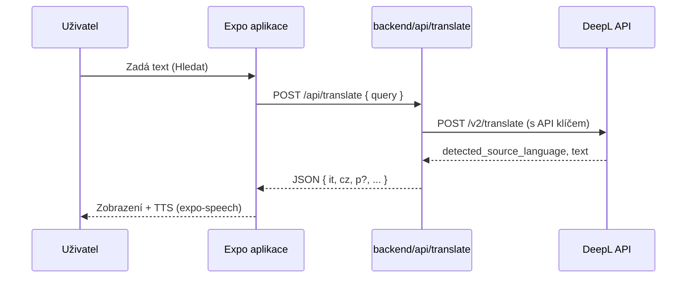
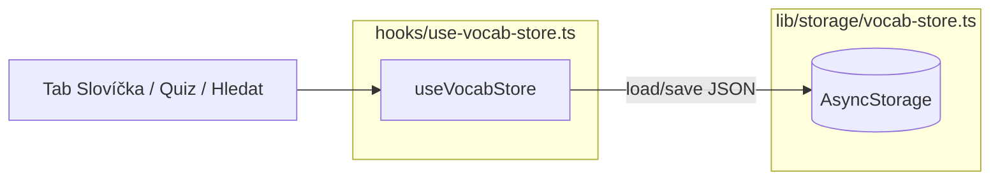

# Italiano — architektura aplikace

Tento dokument popisuje účel jednotlivých částí projektu, tok dat a rozšíření mimo samotnou Expo aplikaci.

---

## 1. Cíl produktu

Aplikace podporuje **pasivní učení** (čtení lekcí, poslech TTS) a **aktivní** (vlastní slovíčka, opakování, vyhledávání). Překlad z češtiny do italštiny a zpět je řešen přes **DeepL** tak, aby se **API klíč neobjevil v mobilním klientovi**.

---

## 2. Hlavní technologie

| Vrstva | Technologie |
|--------|-------------|
| UI | React Native 0.81, Expo SDK ~54 |
| Navigace | Expo Router (file-based routing) |
| Styly | StyleSheet + centrální tokeny (`constants/theme.ts`), fonty Nunito (`@expo-google-fonts/nunito`) |
| Lokální persist | `@react-native-async-storage/async-storage` |
| TTS | `expo-speech` (jazyk `it-IT`) |
| Překlad (síť) | `fetch` na vlastní HTTP endpoint |
| Obsah lekcí (síť) | `GET` manifest + JSON bundly z backendu, cache v AsyncStorage (`italiano.content.*`) |
| Backend (proxy) | Vercel: `backend/api/translate.ts` (DeepL), `content-manifest` / `content-bundle` (JSON) |

---

## 3. Struktura repozitáře

```text
italiano/
├── app/                    # Expo Router — routy a obrazovky
│   ├── _layout.tsx         # Kořen: fonty, Stack, SafeArea
│   ├── (tabs)/             # Spodní navigace (4 záložky)
│   │   ├── _layout.tsx
│   │   ├── index.tsx       # Hledat
│   │   ├── vocab.tsx       # Slovíčka
│   │   ├── quiz.tsx        # Opakování
│   │   └── lessons.tsx     # Hub lekcí (mřížka karet)
│   └── lessons/            # Stack obrazovky mimo tab bar
│       ├── grammar.tsx
│       ├── situations.tsx
│       ├── numbers.tsx
│       ├── alphabet.tsx
│       ├── weekdays.tsx
│       ├── months.tsx
│       ├── curated-vocab.tsx
│       ├── basics-quiz.tsx
│       ├── time.tsx
│       ├── seasons.tsx
│       ├── colors-shapes.tsx
│       ├── ordinals.tsx
│       ├── holidays-it.tsx
│       ├── weather.tsx
│       ├── family.tsx
│       ├── body-health.tsx
│       ├── food-drinks.tsx
│       ├── false-friends.tsx
│       └── abbreviations.tsx
├── assets/
│   ├── data/               # JSON vestavěný do binárky + sdílené typy
│   └── images/             # Ikona, splash, favicon, adaptive icon
├── backend/
│   ├── api/translate.ts    # Edge handler → DeepL
│   ├── api/content-manifest.ts
│   ├── api/content-bundle.ts
│   ├── content/            # JSON zdroje pro vzdálenou synchronizaci
│   ├── package.json
│   └── README.md
├── components/             # Znovupoužitelné UI (tlačítka, screen wrapper, …)
├── constants/theme.ts      # Barvy, mezery, typografie, stíny
├── hooks/                  # useVocabStore, useItalianTts, useSyncedJson
├── lib/
│   ├── api/translate.ts    # Klient překladu + fallback bez endpointu
│   ├── content/            # Manifest, cache klíče, sync (AsyncStorage)
│   └── storage/vocab-store.ts   # AsyncStorage serializace slovíček
├── scripts/
│   ├── generate-grammar.mjs
│   ├── generate-pron.mjs
│   ├── fill-topic-pron.mjs
│   └── lib/italian-pron.mjs
└── package.json
```

Monorepo je v praxi **„mobilní kořen + podsložka backend“** — sdílený `package.json` je jen u mobilní části; `backend/` má vlastní závislosti pro Vercel CLI / deploy.

---

## 4. Navigace (uživatelský tok)

- **Tab navigator** (`app/(tabs)/`): čtyři záložky — *Hledat*, *Slovíčka*, *Opakování*, *Lekce*.
- **Stack** (`app/_layout.tsx`): nad taby se otevírají obrazovky z `app/lessons/*` s tlačítkem zpět (`BackLink` → `router.back()`).

Důvod: mobilní guideline „max ~5 tabů“ a přehlednost — statický obsah je pod *Lekce* jako karty.

---

## 5. Tok dat — překlad (DeepL)



- **Konfigurace URL:** `process.env.EXPO_PUBLIC_TRANSLATE_ENDPOINT` nebo `expo.extra.translateEndpoint` (`app.json`).
- **Bez URL:** `lookupWord()` vrátí lokální **fallback** (demo překlad), aplikace nespadne.
- **Směr překladu:** proxy používá heuristiku „česky vs italsky“ a nastaví `target_lang` na `IT` nebo `CS`; DeepL současně detekuje zdroj.

---

## 6. Tok dat — slovíčka a opakování



- **Schéma dat:** `VocabWord` (id, it, cz, p, learned, streak) v `assets/data/types.ts`.
- **Pravidlo „naučeno“:** po **třech** správných odpovědích za sebou (`streak >= 3`) se slovo označí jako `learned` (viz `hooks/use-vocab-store.ts`).
- **Seed:** při prázdném úložišti se načte výchozí sada ze `vocab-store.ts`.
- **Cloud / účet:** zatím **není** — slovíčka a postup studia **nejsou** na `backend/`; návrh přihlášení (Google, Apple přes Supabase Auth), sync a free tier je v **[docs/PLAN-auth-sync-offline.md](docs/PLAN-auth-sync-offline.md)**, deployment v **[docs/DEPLOYMENT.md](docs/DEPLOYMENT.md)**.

---

## 7. Obsah lekcí (vestavěný + vzdálená synchronizace)

1. **Vestavěný fallback:** soubory v `assets/data/*.json` jsou součástí buildu — aplikace vždy něco zobrazí.
2. **Cache po synci:** `lib/content/sync-content.ts` při online a nastavené `EXPO_PUBLIC_CONTENT_BASE_URL` (nebo `expo.extra.contentBaseUrl`) stáhne `GET /api/content-manifest` a jednotlivé `GET /api/content-bundle?bundle=…`, validuje JSON a uloží řetězce pod klíči z `lib/content/cache.ts`.
3. **UI:** `hooks/use-synced-json.ts` drží stav z bundlu, po načtení cache přepíše data a po `emitContentUpdated()` znovu načte cache. Uživatelská slovíčka používají **jiné** klíče AsyncStorage — nejsou součástí syncu.

Bez konektivity nebo bez URL zůstane chování čistě lokální (fallback ± stará cache).

**Výslovnost (Czech-friendly):** italské tvary mají u tabulek a karet zobrazenou pomocnou transkripci v hranatých závorkách (např. `[kvattro]`, `[džennajo]`, `[fačamo]`). Generuje ji `scripts/lib/italian-pron.mjs` a v JSON datech ji udržuje `npm run generate:content` — výsledek se zapisuje paralelně do `assets/data/` (vestavěný fallback) i `backend/content/` (vzdálená synchronizace).

---

## 8. UI vrstva

- **`components/screen.tsx`:** `ScrollView` + odsazení kvůli plovoucímu tab baru.
- **`components/screen-header.tsx`:** titul + logo.
- **`components/primary-button.tsx`**, **`play-button.tsx`:** konzistentní akce a přehrání italštiny.
- **Design tokeny** (`Palette`, `Spacing`, `Radius`, `Typography`) drží vizuální jednotu (italská paleta v `constants/theme.ts`).

---

## 9. Bezpečnost a provoz

| Téma | Řešení v projektu |
|------|-------------------|
| DeepL klíč | Pouze na serveru (`DEEPL_API_KEY` u Vercelu / `.env.local` lokálně). |
| Klientské tajemství | Žádné; jen veřejná URL proxy. |
| HTTPS v produkci | Doporučeno pro deploy proxy; lokálně často HTTP + LAN IP. |

---

## 10. Rozšíření (kam sahat při úpravách)

| Funkce | Kam psát |
|--------|-----------|
| Nová lekce z JSON | `assets/data/*.json` + `backend/content/*.json` + `lib/content/bundle-ids.ts` + manifest na serveru + obrazovka v `app/lessons/` + karta v `app/(tabs)/lessons.tsx` + `Stack.Screen` v `app/_layout.tsx`. |
| Vzdálený obsah / verze | `backend/api/content-manifest.ts`, `CONTENT_VERSION`, `lib/content/sync-content.ts`. |
| Změna překladu / formátu API | `backend/api/translate.ts` + typ `LookupResult` + `lib/api/translate.ts`. |
| Nová pravidla gramatiky / slovesa | Upravit `scripts/generate-grammar.mjs`, pak `npm run generate:grammar`. |
| Pravidla fonetického přepisu | `scripts/lib/italian-pron.mjs` + spustit `npm run generate:content` (pře-vygeneruje `grammar.json` i číslovky/abecedu/dny/měsíce). |
| Témata / barvy | `constants/theme.ts` + případně assety v `assets/images/`. |

---

## 11. Testování a kvalita

- **TypeScript:** `npx tsc --noEmit`
- **Lint:** `npm run lint` (Expo ESLint)
- **Manuální:** Expo Go / simulátor — zejména TTS a síťové volání na vlastní IP

Automatické UI testy v repozitáři zatím nejsou součástí šablony.

---

## 12. Známá omezení

- DeepL nevrací fonetickou transkripci do pole `p` — pole je připravené pro ruční doplnění nebo budoucí LLM krok na proxy.
- Heuristika směru překladu není 100% spolehlivá u krátkých nejednoznačných řetězců.
- Velký `grammar.json` zpomaluje jen start bundleru nepatrně; pro extrémní růst zvaž split podle kapitol nebo lazy load (strategie: [docs/PLAN-auth-sync-offline.md](docs/PLAN-auth-sync-offline.md) § 6).

---

Doplňky k tomuto dokumentu patří do **README.md** (instalace, DeepL, spuštění). Při větší změně architektury aktualizuj oba soubory.
