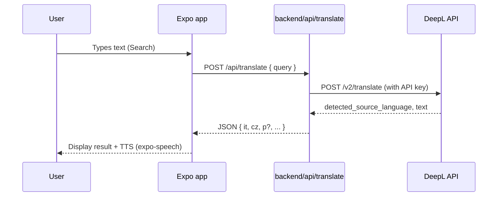
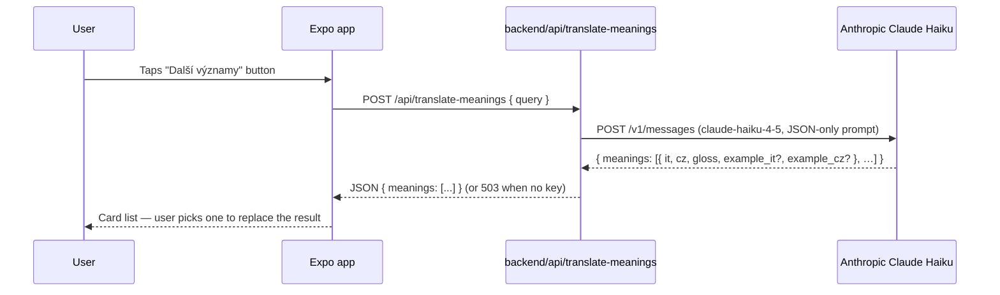
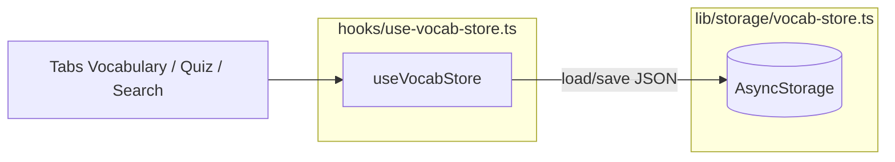

# Italiano — Application Architecture

This document describes the purpose of each part of the project, the data flow and any extensions outside of the Expo app itself.

---

## 1. Product goal

The app supports both **passive learning** (reading lessons, listening to TTS) and **active learning** (custom vocabulary, repetition, lookup). Translation between Czech and Italian is handled through **DeepL**, with **Anthropic Claude Haiku** as an optional second tier for disambiguating ambiguous words via the *Další významy* button. Both API keys live **only on the server** — they never ship with the mobile binary.

---

## 2. Main technologies

| Layer | Technology |
|-------|------------|
| UI | React Native 0.81, Expo SDK ~54 |
| Navigation | Expo Router (file-based routing) |
| Styles | StyleSheet + central tokens (`constants/theme.ts`), Nunito fonts (`@expo-google-fonts/nunito`) |
| Local persistence | `@react-native-async-storage/async-storage` |
| TTS | `expo-speech` (language `it-IT`) |
| Translation (network) | `fetch` against a custom HTTP endpoint |
| Lesson content (network) | `GET` manifest + JSON bundles from the backend, cached in AsyncStorage (`italiano.content.*`) |
| Backend (proxy) | Vercel: `backend/api/translate.ts` (DeepL), `backend/api/translate-meanings.ts` (Anthropic Claude Haiku — optional), `content-manifest` / `content-bundle` (JSON) |

---

## 3. Repository layout

```text
italiano/
├── app/                    # Expo Router — routes and screens
│   ├── _layout.tsx         # Root: fonts, Stack, SafeArea
│   ├── (tabs)/             # Bottom navigation (4 tabs)
│   │   ├── _layout.tsx
│   │   ├── index.tsx       # Search
│   │   ├── vocab.tsx       # Vocabulary
│   │   ├── quiz.tsx        # Repetition
│   │   └── lessons.tsx     # Lesson hub (grid of cards)
│   └── lessons/            # Stack screens outside the tab bar
│       ├── grammar.tsx
│       ├── situations.tsx
│       ├── numbers.tsx
│       ├── alphabet.tsx
│       ├── weekdays.tsx
│       ├── months.tsx
│       ├── curated-vocab.tsx
│       ├── time.tsx
│       ├── seasons.tsx
│       ├── colors-shapes.tsx
│       ├── ordinals.tsx
│       ├── holidays-it.tsx
│       ├── weather.tsx
│       ├── family.tsx
│       ├── body-health.tsx
│       ├── food-drinks.tsx
│       ├── false-friends.tsx
│       └── abbreviations.tsx
├── assets/
│   ├── data/               # JSON bundled into the binary + shared types
│   └── images/             # Icon, splash, favicon, adaptive icon
├── backend/
│   ├── api/translate.ts             # Edge handler → DeepL (translation + spell-check fallbacks)
│   ├── api/translate-meanings.ts    # Edge handler → Anthropic Claude Haiku (multiple senses, optional)
│   ├── api/_lib/llm-anthropic.ts    # Minimal fetch-based Anthropic client
│   ├── api/content-manifest.ts
│   ├── api/content-bundle.ts
│   ├── content/                     # JSON sources for remote sync
│   ├── package.json
│   └── README.md
├── components/             # Reusable UI (buttons, screen wrapper, …)
├── constants/theme.ts      # Colors, spacing, typography, shadows
├── hooks/                  # useVocabStore, useItalianTts, useSyncedJson
├── lib/
│   ├── api/translate.ts    # Translation client + offline fallback + AmbiguousQueryError handling (422)
│   ├── api/meanings.ts     # "Další významy" client (Anthropic-backed; gracefully disables on 503)
│   ├── content/            # Manifest, cache keys, sync (AsyncStorage)
│   └── storage/vocab-store.ts   # AsyncStorage serialization for vocabulary
├── scripts/
│   ├── generate-grammar.mjs
│   ├── generate-pron.mjs
│   ├── fill-topic-pron.mjs
│   └── lib/italian-pron.mjs
└── package.json
```

In practice this is a **"mobile root + a backend subfolder"** monorepo — the shared `package.json` belongs to the mobile part; `backend/` has its own dependencies for the Vercel CLI / deploy.

---

## 4. Navigation (user flow)

- **Tab navigator** (`app/(tabs)/`): four tabs — *Search*, *Vocabulary*, *Repetition*, *Lessons*.
- **Stack** (`app/_layout.tsx`): screens from `app/lessons/*` open above the tabs with a back action (`BackLink` → `router.back()`).

Reason: mobile guideline of "max ~5 tabs" and clarity — static content lives under *Lessons* as cards.

---

## 5. Data flow — translation (DeepL)



- **URL configuration:** `process.env.EXPO_PUBLIC_TRANSLATE_ENDPOINT` or `expo.extra.translateEndpoint` (filled from `.env` / EAS via `app.config.ts` — not committed in `app.json`).
- **Without a URL:** `lookupWord()` returns a local **fallback** (demo translation); the app does not crash.
- **Translation direction:** the proxy uses a "Czech vs Italian" heuristic and sets `target_lang` to `IT` or `CS`; DeepL also detects the source.
- **Ambiguity detection:** when DeepL's back-translation diverges from the user's input (typical for diacritic-less Czech, e.g. `pracka` → `lavoro` → `práce`), the proxy throws `AmbiguousQueryError` which the handler returns as **HTTP 422** with `{ ambiguous: true, hint }`. The mobile app renders a warm warning ("DeepL si není jistý — zkus diakritiku") instead of a confidently wrong result.

---

## 5b. Data flow — *Další významy* (multiple senses, optional)



- **Purpose:** disambiguate words with several common meanings (e.g. `sušička` → na prádlo / na potraviny / na vlasy).
- **Trigger:** explicit user button under each DeepL result; never auto-fired (cost + latency control).
- **Without `ANTHROPIC_API_KEY` on the server:** endpoint returns **503**, the mobile client marks the feature as `disabled` and **hides the button** for the rest of the session — DeepL translate keeps working.
- **Model:** `claude-haiku-4-5` by default (override via `ANTHROPIC_MODEL`); ~$0.0001–0.0003 per call.
- **Selection:** picking a meaning replaces `result` with its `{ it, cz, example_it, example_cz }` so the standard *Přidat do slovíček* flow stores the disambiguated variant.

---

## 6. Data flow — vocabulary and repetition



- **Data shape:** `VocabWord` (id, it, cz, p, learned, streak, clientUuid, updatedAt) in `assets/data/types.ts`.
- **"Learned" rule:** after **three** correct answers in a row (`streak >= 3`) a word is marked `learned` (see `hooks/use-vocab-store.ts`).
- **Seed:** when storage is empty the default set from `vocab-store.ts` is loaded.
- **Cloud / account:** the app ships with a **Supabase Auth + Postgres** integration (Google + Apple) and offline-first sync of `vocab_items`. Plan: **[docs/PLAN-auth-sync-offline.md](docs/PLAN-auth-sync-offline.md)**, deployment: **[docs/DEPLOYMENT.md](docs/DEPLOYMENT.md)**.

---

## 7. Lesson content (bundled + remote sync)

1. **Bundled fallback:** files in `assets/data/*.json` are part of the build — the app always has something to show.
2. **Cache after sync:** `lib/content/sync-content.ts` — when online and `EXPO_PUBLIC_CONTENT_BASE_URL` (or `expo.extra.contentBaseUrl` from `app.config.ts`) is configured — fetches `GET /api/content-manifest` and individual `GET /api/content-bundle?bundle=…`, validates the JSON and stores the strings under keys defined in `lib/content/cache.ts`.
3. **UI:** `hooks/use-synced-json.ts` keeps the bundle state, replaces data once cache loads and re-reads cache after `emitContentUpdated()`. User vocabulary uses **separate** AsyncStorage keys — it is not part of content sync.

Without connectivity or without the URL behaviour stays purely local (fallback ± stale cache).

**Pronunciation (Czech-friendly):** Italian forms in tables and cards include a helper transcription in square brackets (e.g. `[kvattro]`, `[džennajo]`, `[fačamo]`). It is generated by `scripts/lib/italian-pron.mjs` and kept in sync inside the JSON data via `npm run generate:content` — the result is written in parallel to `assets/data/` (bundled fallback) and `backend/content/` (remote sync).

---

## 8. UI layer

- **`components/screen.tsx`:** `ScrollView` + bottom padding for the floating tab bar.
- **`components/screen-header.tsx`:** title + logo.
- **`components/primary-button.tsx`**, **`play-button.tsx`:** consistent actions and Italian playback.
- **Design tokens** (`Palette`, `Spacing`, `Radius`, `Typography`) keep visual unity (Italian palette in `constants/theme.ts`).

---

## 9. Security and operations

| Topic | Project decision |
|-------|------------------|
| DeepL key | Server-only (`DEEPL_API_KEY` in Vercel / `backend/.env` locally for `vercel dev`). |
| Anthropic key | Server-only (`ANTHROPIC_API_KEY`, optional). Mobile app only knows about the public `/api/translate-meanings` URL. |
| Client secret | None; only the public proxy URL. |
| HTTPS in production | Recommended for the proxy deploy; locally HTTP + LAN IP is fine. |

---

## 10. Extensions (where to make changes)

| Feature | Where to edit |
|---------|---------------|
| New JSON-driven lesson | `assets/data/*.json` + `backend/content/*.json` + `lib/content/bundle-ids.ts` + manifest on the server + screen in `app/lessons/` + card in `app/(tabs)/lessons.tsx` + `Stack.Screen` in `app/_layout.tsx`. |
| Remote content / version | `backend/api/content-manifest.ts`, `CONTENT_VERSION`, `lib/content/sync-content.ts`. |
| Translation / API format | `backend/api/translate.ts` + the `LookupResult` type + `lib/api/translate.ts`. |
| Multiple meanings (LLM) | `backend/api/translate-meanings.ts` (prompt, response shape) + `backend/api/_lib/llm-anthropic.ts` (model, timeout) + `WordMeaning` in `assets/data/types.ts` + `lib/api/meanings.ts` + UI in `app/(tabs)/index.tsx`. |
| New grammar rules / verbs | Edit `scripts/generate-grammar.mjs`, then `npm run generate:grammar`. |
| Phonetic transcription rules | `scripts/lib/italian-pron.mjs` + run `npm run generate:content` (regenerates `grammar.json`, numbers, alphabet, weekdays, months). |
| Theme / colors | `constants/theme.ts` and optionally assets in `assets/images/`. |

---

## 11. Testing and quality

- **TypeScript:** `npx tsc --noEmit`
- **Lint:** `npm run lint` (Expo ESLint)
- **Manual:** Expo Go / simulator — especially TTS and network calls against your own IP

Automated UI tests are not part of the template yet.

---

## 12. Known limitations

- DeepL does not return phonetic transcription in the `p` field — the field is reserved for a manual fill-in or a future LLM step on the proxy.
- The translation-direction heuristic is not 100% reliable for short ambiguous strings — the proxy now detects this and returns HTTP 422 (`ambiguous`) so the app prompts for diacritics. Truly ambiguous words (e.g. `sušička`) still rely on the user clicking *Další významy*.
- *Další významy* requires an Anthropic key on the server; when absent the feature silently degrades (button hidden) instead of erroring.
- A large `grammar.json` only slightly slows the bundler startup; for extreme growth consider chapter-based splits or lazy loading (strategy: [docs/PLAN-auth-sync-offline.md](docs/PLAN-auth-sync-offline.md) § 6).

---

Additions to this document belong in **README.md** (installation, DeepL, running). When the architecture changes significantly, update both files.
